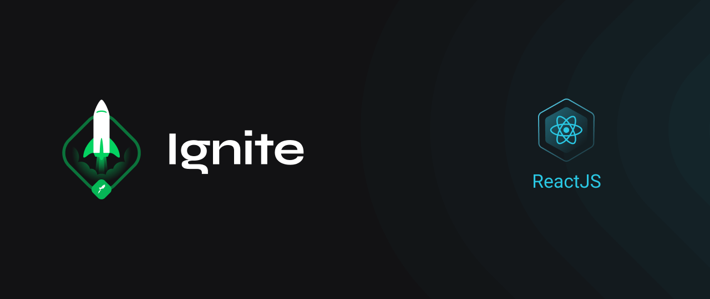

<!--banner-->
<div align="center">
  
</div>

<!--logo-->
<br/>
<div align="center">
  
</div>

## Sobre o projeto
dt money é uma aplicação para auxiliar no controle das finanças pessoais 💰

#### Projeto desenvolvido durante o programa ignite, no chapter II da trilha de ReactJs.

# 📌 Contents
- [📌 Contents](#-contents)
- [🚀 Technologies](#-technologies)
- [📷 Screenshot](#-screenshot)
- [💻 How to run](#-how-to-run)


# 🚀 Technologies
* [Typescript](https://www.typescriptlang.org/)
* [React](https://reactjs.org/)
* [Styled Components](https://styled-components.com/)
* [MirageJS](https://miragejs.com/)


# 📷 Screenshot
<div align="center">
  
  
</div>

# 💻 How to run
```
  # Clone Repository
  $ git clone https://github.com/renanloureiroo/dtmoney.git
```

```
  # Install Dependencies
  $ yarn 

  # Run application
  $ yarn start
```

Acesse http://localhost:3000 em seu browser para ver o resultado.


